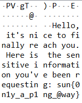
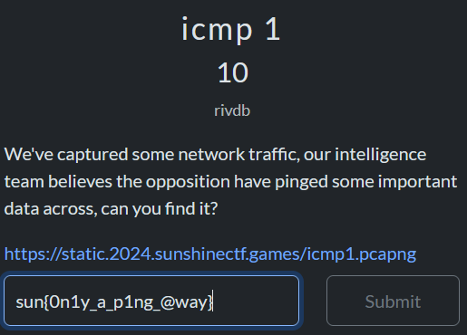

# icmp 1
### SunshineCTF 2024 -- live competition
` forensics `
# 
### Summary
First forensics challenge to search for a flag hidden in various packets.

### Setting and Software
This CTF was completed utilzing Wireshark

### Given Media
- Wireshark packet capture ` icmp1.pcapng `

## Execution

### Download Files
Download the given Wireshark file and open in the Wireshark software. You will see 3136 packets that must be searched through to find the flag.

### Search for Flag
Given the wording of the challenge itself, we can assume that the flag can be found in a *ping* packet, or an ICMP protocol. This is a simple search where we must apply a Display Filter to find the ICMP protocol packets. Placing ***ICMP*** in the Display Filter search box produced exactly 24 packets that fall under this protocol, which is much more reasonable to search through.  

Manually searching through the files reveals the flag. Packet No. 3135 first reveals the flag.

## Result

### Flag
` sun{0n1y_a_p1ng_@way} `

### Thoughts
I completed this second. It wasn't too complex like the previous one. It was fun to search through the packets.

## References
[1] https://sunshinectf.org/