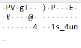

# icmp 2
### SunshineCTF 2024 -- live competition
` forensics `
# 
### Summary
Second forensics challenge to search for a flag hidden in various packets.

### Setting and Software
This CTF was completed utilzing Wireshark

### Given Media
- Wireshark packet capture ` icmp2.pcapng `

## Execution

### Download Files
Download the given Wireshark file and open in the Wireshark software. You will see 5997 packets that must be searched through to find the flag.

### Search for Flag
Given the wording of the challenge itself and the previous ICMP1 challenge, we can assume that the flag can be found in a *ping* packet, or an ICMP protocol. This is a simple search where we must apply a Display Filter to find the ICMP protocol packets. Placing ***ICMP*** in the Display Filter search box produced exactly 10 packets that fall under this protocol, which is much more reasonable to search through.  

Looking through the first packet displayed, No. 5449, we see a message stating the flag has been dispersed throughout the ping packets. 

The flag is scattered through the following text:

From packet 5976 

From packet 5978 

From packet 5980 

From packet 5982 

## Result

### Flag
` sun{1cmp_1s_4un_1337} `

### Thoughts
This was a fun step into the competition. I personally love going through packets so I had a great deal of fun searching!

## References
[1] https://sunshinectf.org/