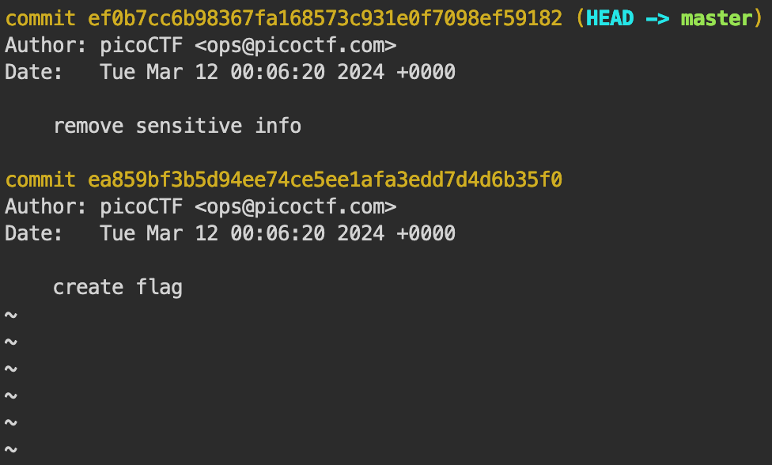

# Commitment Issues
### picoCTF -- practice
` easy ` `general skills` `picoCTF 2024`
# 
### Summary
This exercise primarily focuses on the usage of git [1] to find the flag. Git is a version control tool used regularly by developers. In various CTF events, there are usually hidden flags within old git commits.

### Setting and Software
This CTF was completed in the picoCTF webshell. No other software or tools were needed.

### Given Media
- zip file to download

## Execution

### Download Files
The flag is somewhere within the given zip file. A link is given to download the zip, and it is be expected to be found within. To download and open files enter the following commands: 

**download**: 
` wget https://artifacts.picoctf.net/c_titan/137/challenge.zip ` 
**unzip**: 
` unzip challenge.zip `

### Search for Flag

#### Initial Search
Given the wording of the challenge it can be inferred that this challenge will require the utilization of git. This is confirmed with the hints as well. 

After performing the file download and unzip, there is a directory which is revealed, titled ***drop-in***. Inspecting this directory reveals there is exactly one file titled ***message.txt***. It is likely that the flag can be found somewhere within this file.

Reviewing the contents within it displays the following message: ***"TOP SCERET"***. Given that there is no other information found within this file, it is a good idea to start exploring ways to recover previous versions.

#### Git
The flag is likely within a previous version of the ***message.txt*** file. To see all previous commits I entered the following: 
 `git log`

Breaking this down: 
` git ` | calls git  
` log ` | shows previous commits   

This displays the following results:

Figure 1 - Commit Log
 

Here we see two different commits, the current one where sensitive information was removed, and the first iteration which contained the flag. I want to go to the first commit to see if the flag is contained within this text file.

Git allows for viewing of previous commits, given that this is a version control software. To view this commit, I need the commit id. This is the long string of characters in yellow after the word commit found in *Figure 1*. To view this specific commit I entered the following:
 `git checkout ea859bf3b5d94ee74ce5ee1afa3edd7d4d6b35f0`

Breaking this down: 
` git ` | calls git  
` checkout ` | shows previous commits   
`ea859bf3b5d94ee74ce5ee1afa3edd7d4d6b35f0 ` | commit id

After executing this command, I am given a message stating I am successfully in the previous commit. This means I now have access to the old version of ***message.txt*** file. Viewing the contents of this file now reveals the flag.

## Result

### Flag
` picoCTF{s@n1t1z3_cf09a485} `

### Thoughts
I enjoyed this exercise. Being able to utilize Git is important in the development of software. I use version control for most of my projects through GitHub. It is fun to do a bit of forensic work to find the hidden flag!

## References
[1] Git - https://git-scm.com/ 

## All Steps - DIY
`-$ wget https://artifacts.picoctf.net/c_titan/137/challenge.zip` -- USER gets file 
`...downloaded successfully` - SYSTEM downloads 
`-$ unzip challenge.zip` --- USER unzips the file just downloaded 
`...unzipped successfully` - SYSTEM unzips the file 
`-$ ls` --- USER views files 
`... challenge.zip drop-in` - SYSTEM displays files and directories being challenge.zip and drop-in (both directories) 
`-$ cd drop-in` --- USER changes directory to drop-in 
`... changes directory` - SYSTEM changes to drop-in directory 
`-$ ls` 
`... message.txt` - SYSTEM displays files and directories being message.txt (file)   
`-$ cat message.txt` --- USER calls to display contents within message.txt 
`... TOP SCERET` - SYSTEM displays message.txt contents 
`-$ git log` --- USER requests all commit ids 
`... ` - SYSTEM displays all commit ids 
`-$ git checkout ea859bf3b5d94ee74ce5ee1afa3edd7d4d6b35f0 ` --- USER heads to previous commit  
`... ` - SYSTEM loads previous commit  
`-$ cat message.txt` --- USER calls to display contents within message.txt  
`... picoCTF{s@n1t1z3_cf09a485}` - SYSTEM displays message.txt contents

## All Steps - To the Treasure
`-$ wget https://artifacts.picoctf.net/c_titan/137/challenge.zip` -- USER gets file 
`...downloaded successfully` - SYSTEM downloads 
`-$ unzip challenge.zip` --- USER unzips the file just downloaded 
`...unzipped successfully` - SYSTEM unzips the file 
`-$ cd drop-in` --- USER changes directory to drop-in 
`... changes directory` - SYSTEM changes to drop-in directory 
`-$ git checkout ea859bf3b5d94ee74ce5ee1afa3edd7d4d6b35f0 ` --- USER heads to previous commit  
`... ` - SYSTEM loads previous commit  
`-$ cat message.txt` --- USER calls to display contents within message.txt  
`... picoCTF{s@n1t1z3_cf09a485}` - SYSTEM displays message.txt contents